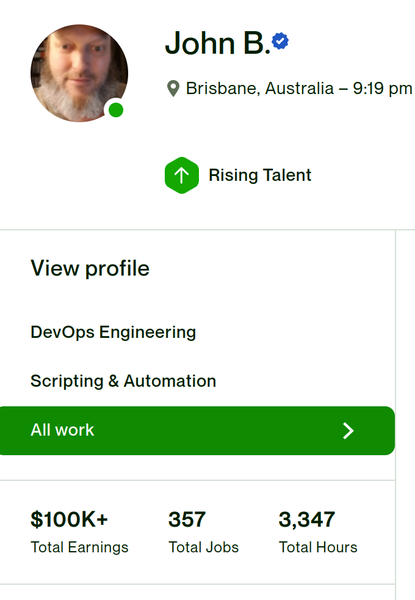
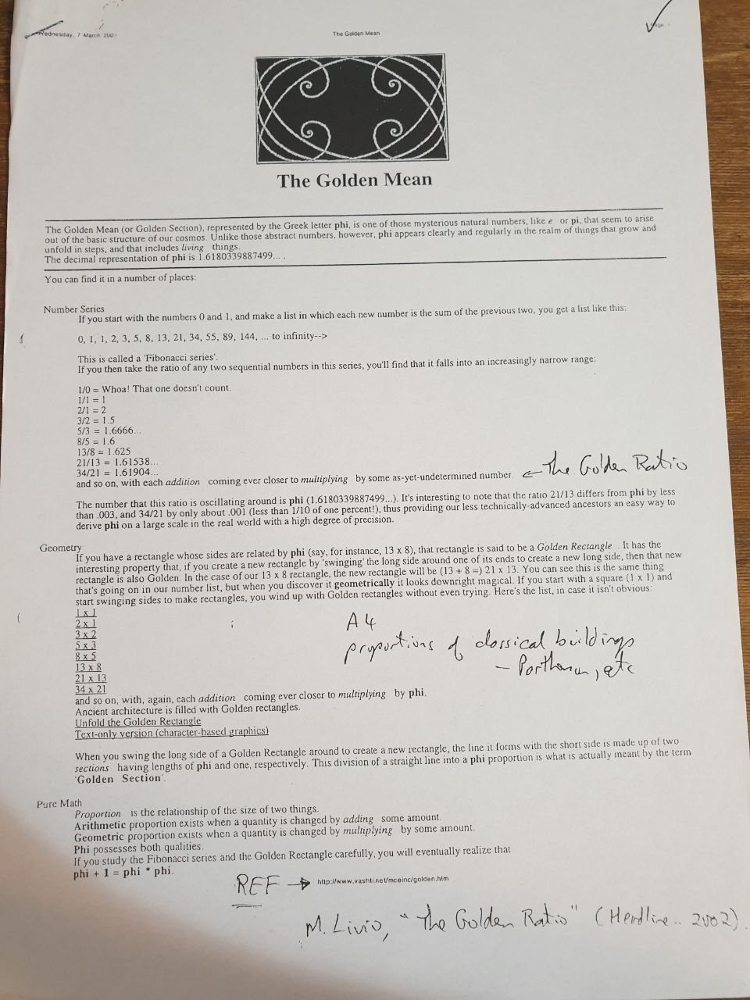
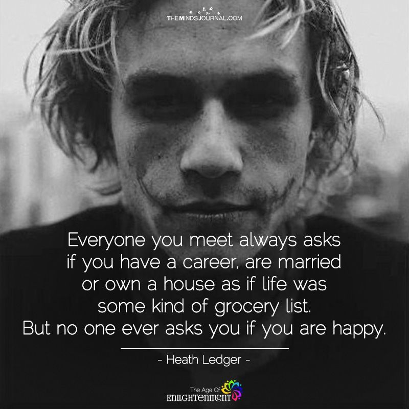

# Welcome

- 🤓😎 Hi, I’m [John Bampton](https://github.com/jbampton)
- 💼 I’m interested in `Event Hosting and Marketing`, `Management Consulting`, `Team Building` and [Chess Variants](https://en.wikipedia.org/wiki/List_of_chess_variants)
- 💎 I’m currently learning `RubyFu` with `Street Smarts`
- 🩱 I’m an `event host`, a meetup dot com `co-organizer` and a `member of the management team` at [Brisbane Social Chess](https://github.com/brisbanesocialchess)

## Old Career on Upwork

I had a freelancer profile on Upwork from early 2009 until 2024.
Total client payments to me were about 140k USA dollars.
In 2024 I deleted my Upwork profile since I no longer agree with their marketplace practices.
The next image is a screen shot of some statistics from my old freelancer profile

## Random Photos

